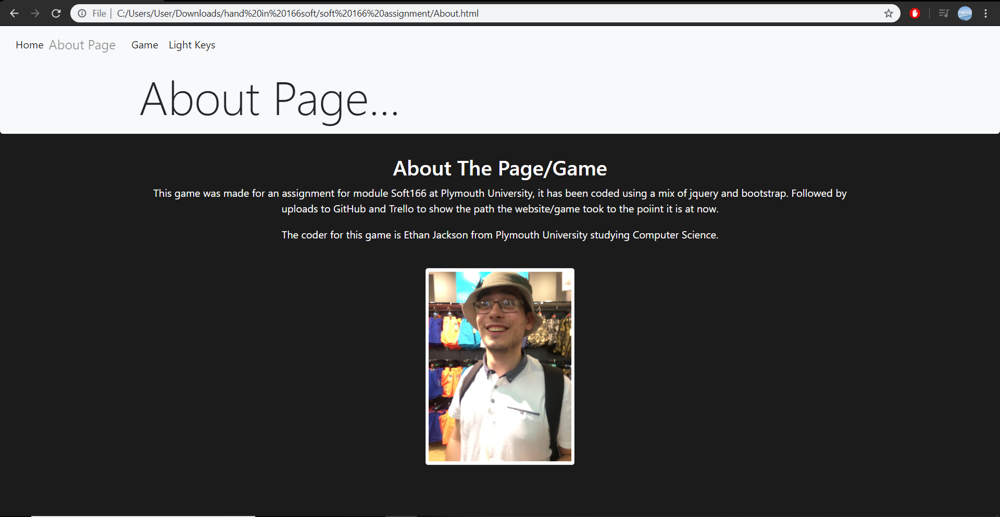

# ejackson
---
## screenshots
Homepage:

About: 

Game: 

Key Lights:
 

## Web Test
Chrome:
Tested if the game played on Chrome. I would make some small changes to make it look btter/ more user friendly.
 

Microsoft Edge:
Tested if the game played on Microsoft Edge, I would change it so it looks better as all the icons are smaller and a lot of empty space is left.
 

Internet Explorer:
Tested on Internet Explorer, the navigation would work but the game itself would not work at all with the start button not working.

## Wire Frame/ Site Map/ Feedback
The file has feedback from the demo session, including the wireframe and sitemap.
[Web Design Document](web%20design%20document.docx)

## Application Fact Sheet
[Application Fact Sheet](Application%20Fact$20Sheet.docx)

## Demo Session Feedback
[Demo Feedback](demofeedback.docx)

## Youtube demo 

## Extra Website Features
Added home page feature so you can hover over the pictures so increase scale:

Added game page feature so the colour buttons are disabled to begin with:

Added game page feature so the information scale increases when hovered over:

